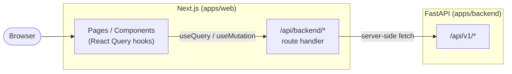

# Vendor Platform Monorepo

Two apps in one repository:

| App | Path | Stack |
|---|---|---|
| **Backend API + worker** | [`apps/backend`](apps/backend) | Python 3.10, FastAPI, SQLAlchemy 2.0 (async), pgvector, ARQ, Gemini |
| **Web dashboard** | [`apps/web`](apps/web) | Next.js 14 (App Router), React 18, TanStack Query, Tailwind |

The web app talks to the backend through a **Backend-For-Frontend (BFF)** proxy inside Next.js — `BACKEND_URL` stays server-side, the browser only sees `/api/backend/*`.

---

## Repo layout

```
vendor-platform/
├── apps/
│   ├── backend/                  # FastAPI service (see apps/backend/README.md for full docs)
│   │   ├── app/                  # API, services, repos, models, workers
│   │   ├── alembic/              # Migrations
│   │   ├── uploads/  reports/    # Local runtime output (gitignored)
│   │   ├── pyproject.toml
│   │   └── .env
│   └── web/                      # Next.js dashboard
│       ├── src/
│       │   ├── app/              # App-Router pages + BFF route
│       │   │   ├── api/backend/[...path]/route.ts   # BFF proxy → FastAPI
│       │   │   ├── vendors/…     # list / new / [id]
│       │   │   └── work-requirements/…
│       │   ├── components/       # UI kit, forms, RecommendationsPanel
│       │   └── lib/              # types, api-client, React Query hooks
│       ├── package.json
│       └── .env.example
├── package.json                  # npm workspaces
└── README.md                     # this file
```

## Prerequisites

- **Backend**: Python 3.10+, [`uv`](https://docs.astral.sh/uv/), local Redis, Neon Postgres project with `pgvector`, Gemini API key.
- **Web**: Node.js 18.18+ and npm.

## Setup

```bash
# 1. Backend deps
cd apps/backend
uv sync
cp .env  # already contains DATABASE_URL / REDIS_URL / GEMINI_API_KEY

# Enable pgvector on Neon (one-time, in the SQL editor):
#   CREATE EXTENSION IF NOT EXISTS vector;

uv run alembic upgrade head
cd ../..

# 2. Web deps (installs both workspaces)
npm install

# 3. Web env
cp apps/web/.env.example apps/web/.env
# Default BACKEND_URL=http://localhost:8000 is fine for local dev.
```

## Running everything

Three processes:

```bash
# Terminal A — FastAPI
cd apps/backend
uv run uvicorn app.main:app --reload --port 8000

# Terminal B — ARQ worker (for /report background jobs)
cd apps/backend
uv run arq app.workers.queue.WorkerSettings

# Terminal C — Next.js
npm run dev:web
```

Open http://localhost:3000. FastAPI OpenAPI docs still at http://localhost:8000/docs.

## BFF pattern

All client-side data fetching goes through `/api/backend/<path>`, implemented in
[`apps/web/src/app/api/backend/[...path]/route.ts`](apps/web/src/app/api/backend/[...path]/route.ts).

That handler runs in Node (server-side) and forwards the request to
`${BACKEND_URL}/api/v1/<path>`. Benefits:

- `BACKEND_URL` is a **server-only** env var — never leaks to the browser bundle.
- No CORS setup needed on FastAPI — same origin from the browser's POV.
- Easy hook point for future auth: attach a session cookie here, exchange it for
  a backend JWT, and inject `Authorization: Bearer …` before proxying.

Client code just calls `/api/backend/vendors`, `/api/backend/recommendations/{id}`, etc.

## Data flow



## What's built in the web app

- **Dashboard** — vendor + work-requirement counts, getting-started checklist.
- **Vendors** — list, create, edit (rating + status editable), soft-delete. Documents list on the detail page.
- **Work requirements** — list (with priority/status pills), create, edit (status transitions), soft-delete.
- **Recommendations panel** on the work-requirement detail page — ranked vendors with score breakdown (40/30/30) and a button to enqueue the AI justification report.

All server state is cached & invalidated through TanStack Query with per-resource query keys.

## Scripts (root)

| Command | Effect |
|---|---|
| `npm run dev:web` | Next.js dev server on :3000 |
| `npm run build:web` | Production build |
| `npm run start:web` | Serve the production build |
| `npm run lint:web` | ESLint |

## Backend docs

See [`apps/backend/README.md`](apps/backend/README.md) for full backend design — architecture diagram, DB schema, recommendation scoring formula, Gemini usage (embeddings + structured JSON reports), assumptions, trade-offs, and the remaining "future scope" gaps.
