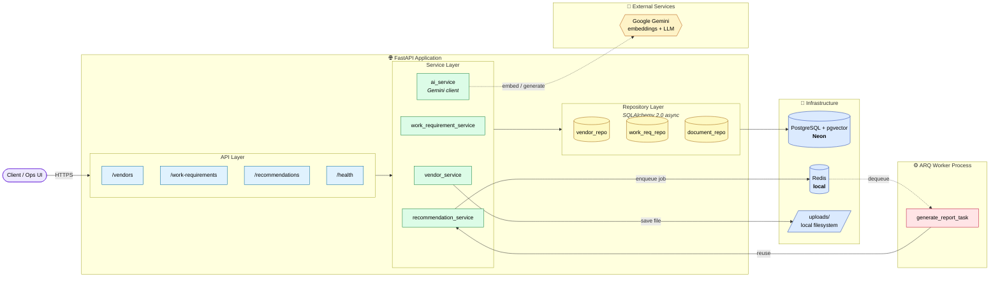

# Intelligent Vendor Recommendation Platform

An MVP backend that lets an operations team register vendors, post work requirements, and get **AI-ranked vendor recommendations** for each requirement. Built with FastAPI, PostgreSQL (via Neon) + `pgvector`, Redis (local) for background jobs, and Google Gemini for embeddings & LLM summaries.

---

## Table of contents

- [Project Architecture](#project-architecture)
- [Database Design](#database-design)
- [API Design](#api-design)
- [Recommendation Logic](#recommendation-logic)
- [AI Usage](#ai-usage)
- [Assumptions](#assumptions)
- [Trade-offs](#trade-offs)
- [Setup](#setup)
- [Running the app](#running-the-app)
- [Next steps / Future scope](#next-steps--future-scope)

---

## Project Architecture

Layered, async-first Python service. High-level component & request flow:



- **API layer** — thin FastAPI routers that only handle HTTP concerns.
- **Service layer** — business logic (scoring, orchestration, AI calls).
- **Repository layer** — DB access, keeps SQL out of services.
- **Workers** — ARQ background workers (`app/workers/queue.py`) consume the same Redis instance the API enqueues into; the API returns `202 Accepted` immediately for long-running jobs (report generation).
- **Async all the way**: `asyncpg` driver, `client.aio` for Gemini, async SQLAlchemy sessions.

Key files: [app/main.py](app/main.py), [app/api/v1/router.py](app/api/v1/router.py), [app/services/recommendation.py](app/services/recommendation.py), [app/workers/queue.py](app/workers/queue.py).

---

## Database Design

PostgreSQL (Neon-hosted) with the `pgvector` extension. Managed by Alembic.

### Tables

**`vendors`** — [app/models/vendor.py](app/models/vendor.py)

| Column | Type | Notes |
|---|---|---|
| id | UUID | PK (from `AuditBase`) |
| name | str | indexed |
| vendor_type | str | |
| category | str | indexed |
| contact_email | str | unique |
| contact_phone | str | nullable |
| operating_location | str | indexed — used as hard filter |
| rating | float | 0.0–5.0 |
| current_status | str | `Active` / `Inactive` / `Blacklisted` |
| max_budget_capacity | float | nullable, in currency units |
| capabilities_description | text | the source text used to embed |
| semantic_profile | `vector(768)` | Gemini embedding, `RETRIEVAL_DOCUMENT` task |
| created_at / updated_at / created_by | audit fields | from `AuditBase` |

**`work_requirements`** — [app/models/work_requirement.py](app/models/work_requirement.py)

| Column | Type | Notes |
|---|---|---|
| id | UUID | PK |
| title | str | |
| description | text | |
| category | str | indexed |
| location | str | indexed — must match a vendor's `operating_location` |
| estimated_value | float | budget the work requires |
| priority | str | `Low` / `Medium` / `High` |
| expected_start_date | date | |
| status | str | `Open` / `Sourcing` / `Awarded` / `Closed` |

**`vendor_documents`** — [app/models/document.py](app/models/document.py)

| Column | Type | Notes |
|---|---|---|
| id | UUID | PK |
| vendor_id | UUID | FK → `vendors.id`, `ON DELETE CASCADE` |
| document_type | str | e.g. `Tax`, `Insurance` |
| file_path | str | local `uploads/` path (MVP) |
| expiry_date | date | nullable |
| verification_status | str | `Pending` / `Verified` / `Rejected` |

### Relationships & indexes

- `Vendor 1—* VendorDocument` (`selectinload` used to avoid N+1).
- Location and category are indexed because recommendations filter/rank on them.
- `contact_email` is `UNIQUE` to prevent duplicate vendor registrations.
- `semantic_profile` is a `pgvector` column; cosine distance is computed in-SQL via `.cosine_distance()`.

---

## API Design

All routes are versioned under `/api/v1`. OpenAPI docs auto-served at `/docs`.

| Method | Path | Purpose |
|---|---|---|
| `GET`  | `/health` | Liveness + env info |
| `POST` | `/vendors` | Create vendor (auto-generates embedding) |
| `GET`  | `/vendors` | Paginated list of active vendors |
| `GET`  | `/vendors/{vendor_id}` | Fetch vendor with documents |
| `PATCH`| `/vendors/{vendor_id}` | Partial update (re-embeds if capabilities change) |
| `DELETE`| `/vendors/{vendor_id}` | Soft delete (sets `deleted_at`) |
| `POST` | `/vendors/{vendor_id}/documents` | Multipart upload of a compliance document |
| `POST` | `/work-requirements` | Create a work requirement |
| `GET`  | `/work-requirements` | Paginated list |
| `GET`  | `/work-requirements/{id}` | Fetch a single requirement |
| `PATCH`| `/work-requirements/{id}` | Partial update (status transitions, etc.) |
| `DELETE`| `/work-requirements/{id}` | Soft delete |
| `GET`  | `/recommendations/{work_requirement_id}` | Ranked list of vendors + score breakdown |
| `POST` | `/recommendations/{work_requirement_id}/report` | Enqueue async AI justification report (`202`) |

### Conventions

- Pydantic schemas in [app/schemas](app/schemas) enforce request/response contracts (except the recommendations response, which is still a raw dict — see *Trade-offs*).
- Repositories inherit from a generic `BaseRepository[Model, CreateSchema, UpdateSchema]` — CRUD boilerplate lives once.
- Long-running work (LLM report generation) goes through ARQ, so the HTTP request never blocks on Gemini generation.

---

## Recommendation Logic

Implemented in [`RecommendationService.get_recommendations`](app/services/recommendation.py).

**Step 1 — Hard filter (SQL).** In [app/repository/vendor.py](app/repository/vendor.py) `get_recommendation_candidates`:
- `current_status == 'Active'` (drops Inactive/Blacklisted vendors)
- `operating_location == work_requirement.location` (geographic constraint)

**Step 2 — Semantic retrieval (SQL, pgvector).** For each candidate, compute
`cosine_distance(vendor.semantic_profile, query_vector)` where `query_vector` is the Gemini embedding of `"Category: {category}. Task: {description}"`. Distance is returned alongside the row.

**Step 3 — Soft scoring (Python, deterministic).** Each candidate is scored out of **100**:

| Component | Weight | Formula |
|---|---|---|
| Semantic match | **40** | `(1 − cosine_distance) × 40`, floored at 0 |
| Rating         | **30** | `(rating / 5.0) × 30` |
| Budget fit     | **30** | `30` if `max_budget_capacity ≥ estimated_value`, else `(capacity / estimated_value) × 30` (partial credit) |

**Step 4 — Sort descending by total score**, return with a per-vendor `breakdown` so the operations team sees *why* a vendor ranked where it did.

Rationale: keep the ranking **explainable and reproducible**. The AI provides only the semantic signal; the business rules (rating, budget) are transparent arithmetic the team can audit and tune.

---

## AI Usage

Google Gemini via the `google-genai` SDK — see [app/services/ai.py](app/services/ai.py).

Two distinct uses:

1. **Embeddings (`gemini-embedding-2`, 768 dims)**
   - `RETRIEVAL_DOCUMENT` task type when embedding a vendor's `capabilities_description` at create time → stored in `vendors.semantic_profile`.
   - `RETRIEVAL_QUERY` task type when embedding a work requirement at recommendation time.
   - Using the two task types (as Gemini recommends) improves retrieval quality vs. embedding both sides identically.

2. **Structured vendor report (`gemini-3.1-flash-lite`, JSON mode)**
   - Triggered via `POST /recommendations/{id}/report`.
   - The API enqueues an ARQ job → the worker fetches the top-3 recommendations, sends a prompt to Gemini asking for a **structured** report.
   - Uses Gemini's `response_mime_type="application/json"` + `response_schema=VendorReport` so the model is constrained to the Pydantic shape defined in [app/schemas/report.py](app/schemas/report.py). No fragile string parsing — the SDK returns a validated `VendorReport` object.
   - Report shape (roughly):
     ```json
     {
       "work_requirement_id": "…",
       "headline": "one-line TL;DR",
       "executive_summary": "2–3 sentences",
       "primary_recommendation": {
         "vendor_id": "…", "name": "…", "score": 87.4,
         "justification": "…",
         "risks": [{"category": "budget", "level": "MEDIUM", "detail": "…"}]
       },
       "alternatives": [ /* runner-ups, same shape */ ],
       "overall_risks": ["thin candidate pool", "…"],
       "confidence": "HIGH"
     }
     ```
   - `temperature=0.2` for stability. Result is logged (MVP); production would persist to an `ai_reports` table and expose `GET .../report/{id}`.

Uses `client.aio` throughout so AI calls don't block the event loop.

---

## Assumptions

- **Location is a hard constraint.** A work requirement in "Mumbai" only surfaces vendors whose `operating_location` is exactly `"Mumbai"`. String-equal, not geo.
- **One embedding per vendor.** The `capabilities_description` field is the sole text used to characterise a vendor semantically. If it's empty or thin, semantic score suffers.
- **Ratings are pre-populated** (seeded or admin-updated). There is no rating-submission endpoint yet.
- **Small vendor pool.** No ANN index on `semantic_profile` — cosine distance is computed for every filtered candidate. Fine up to ~thousands of active vendors per location.
- **Trusted callers.** No authentication or authorization in the MVP; anyone reaching the API can create vendors, upload files, and read recommendations.
- **Local filesystem storage** for uploaded documents (`uploads/`). Adequate for a single-node MVP demo.
- **Single-tenant.** No org/tenant scoping on any table.
- **Neon + local Redis** — Postgres is remote (Neon, SSL enforced), Redis runs on the developer's machine at `redis://localhost:6379/0`.

---

## Trade-offs

- **Explainable scoring vs. learned ranking.** Chose weighted linear scoring (40/30/30) over training a learn-to-rank model. Loses potential accuracy but is auditable, tunable by non-ML users, and needs zero training data — the right call for an MVP.
- **`pgvector` in the same DB vs. a dedicated vector store (Pinecone/Weaviate).** Keeps operational surface tiny (one database, one migration story) at the cost of not having ANN indexing tuned for millions of vectors. Reversible later.
- **ARQ + Redis vs. Celery / cloud tasks.** ARQ is native-async and matches the FastAPI stack; simpler than Celery. Trade-off: smaller ecosystem, fewer built-in features (retries, monitoring dashboards).
- **Two Gemini calls per report vs. cached top-N.** Every report call re-embeds the query and re-runs the pgvector search. Simpler than caching, but wasted work if the same requirement is reported repeatedly.
- **No auth in MVP.** Deliberately deferred so the recommendation flow could be finished end-to-end. Must be added before any real deployment.
- **Local file uploads.** Zero-setup for a demo; will not survive a container restart and provides no MIME/size validation. See *Future scope*.
- **Raw dict for recommendation response.** `List[Dict[str, Any]]` in [recommendations.py](app/api/v1/endpoints/recommendations.py) means no Pydantic contract in OpenAPI. Faster to iterate on the shape; needs a schema before it's a stable API.
- **Fire-and-forget report worker.** The `POST .../report` endpoint returns `202` but the result is only logged. No status endpoint to retrieve the report.

---

## Setup

### Prerequisites

- Python **3.10+** and [`uv`](https://docs.astral.sh/uv/) (project uses `pyproject.toml` + `uv.lock`)
- A local **Redis** instance (default `redis://localhost:6379/0`)
- A **Neon** Postgres project with the `pgvector` extension enabled
- A **Google Gemini** API key

### 1. Clone & install

```bash
git clone <repo-url>
cd vendor-platform
uv sync
```

### 2. Environment variables

Create a `.env` file at the repo root:

```env
ENVIRONMENT=development

# Neon Postgres connection string (with sslmode=require)
DATABASE_URL=postgresql://<user>:<password>@<neon-host>/<db>?sslmode=require

# Local Redis (for ARQ background jobs)
REDIS_URL=redis://localhost:6379/0

# Google Gemini
GEMINI_API_KEY=your-gemini-key
```

The app rewrites `postgresql://` to `postgresql+asyncpg://` automatically (see [app/config/settings.py](app/config/settings.py)).

### 3. Start local Redis

- **Docker:** `docker run -d --name redis -p 6379:6379 redis:7-alpine`
- **WSL/Linux:** `sudo service redis-server start`
- **macOS:** `brew services start redis`

### 4. Enable `pgvector` on Neon

In the Neon SQL editor (once per database):

```sql
CREATE EXTENSION IF NOT EXISTS vector;
```

### 5. Run migrations

```bash
uv run alembic upgrade head
```

---

## Running the app

Open **two** terminals — one for the API, one for the background worker.

**API:**
```bash
uv run uvicorn app.main:app --reload --port 8000
```
Then open http://localhost:8000/docs for the OpenAPI UI.

**ARQ worker** (required for `POST /recommendations/{id}/report`):
```bash
uv run arq app.workers.queue.WorkerSettings
```

### Smoke test

```bash
# 1. Create a vendor
curl -X POST http://localhost:8000/api/v1/vendors -H "Content-Type: application/json" -d '{
  "name": "Acme Electrical",
  "vendor_type": "Contractor",
  "category": "Electrical",
  "contact_email": "ops@acme.example",
  "operating_location": "Mumbai",
  "rating": 4.6,
  "max_budget_capacity": 500000,
  "capabilities_description": "Industrial electrical installation, panel wiring, 24/7 emergency response."
}'

# 2. Create a work requirement in the same location
curl -X POST http://localhost:8000/api/v1/work-requirements -H "Content-Type: application/json" -d '{
  "title": "Warehouse rewiring",
  "description": "Full rewiring of a 20k sq ft warehouse, industrial-grade.",
  "category": "Electrical",
  "location": "Mumbai",
  "estimated_value": 350000,
  "priority": "High",
  "expected_start_date": "2026-08-01"
}'

# 3. Get recommendations (use the ID returned above)
curl http://localhost:8000/api/v1/recommendations/<work_req_id>

# 4. Trigger the async AI report (watch the ARQ worker terminal for output)
curl -X POST http://localhost:8000/api/v1/recommendations/<work_req_id>/report
```

---

## Next steps / Future scope

Gaps deliberately left out of the MVP, roughly in priority order:

1. **Authentication & authorization.** No auth exists today. Needs JWT / API-key + roles (admin, procurement, vendor).
2. **CORS, rate limiting, request-ID logging middleware** — nothing is registered in [app/main.py](app/main.py) beyond the router.
3. **File-upload hardening.** Add MIME/size validation, filename sanitisation (path-traversal risk), and move storage to an object store (S3/GCS) instead of the local `uploads/` directory.
4. **Document verification workflow.** `verification_status` exists but has no endpoint to transition Pending → Verified/Rejected, and no scheduled job to flag expired documents.
5. **Work-requirement award record.** `status` can now be patched, but there's no dedicated "award to vendor" record capturing which vendor won a requirement — the core business outcome still isn't captured.
6. **Vendor rating / feedback loop.** `rating` is static. Needs a post-completion feedback endpoint so recommendations improve over time.
7. **Pydantic response model for recommendations.** Replace `List[Dict[str, Any]]` with a typed schema so OpenAPI is accurate.
8. **AI report retrieval.** `POST .../report` fires-and-forgets. Add persistence (`ai_reports` table) + `GET .../report/{id}` and a job-status endpoint.
9. **Global exception handling & observability.** Structured error responses, metrics, tracing. Today a Redis-connect failure at startup only logs a warning and the app boots into a broken state.
10. **Tests.** No `tests/` directory exists. Needs unit tests for scoring logic + integration tests for the API surface.
11. **DevEx.** `.env.example` in-repo, a `docker-compose.yml` for Redis + the app, and a Makefile / task runner for the common commands.
12. **Scaling knobs.** ANN index on `semantic_profile` (IVFFlat/HNSW) once the vendor pool grows; cached embeddings for repeat queries; ARQ retries + dead-letter handling.
